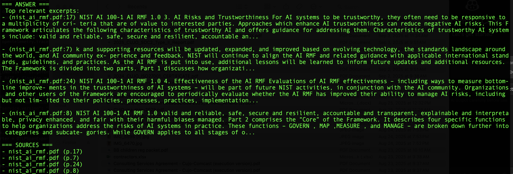

# Week-1 AI Reliability — Baseline

## System
PDFs → chunk → embed (all-MiniLM-L6-v2) → Chroma → retrieve top-K → return excerpts + sources (CLI only).

## Metrics (from logs/interactions.csv)
- Queries: 10
- Latency p95: 0.45s
- No-citation rate: 10%
- Error rate: 0%

## Screenshots
  

## Known issues
- Slow ingest for very large PDFs
- Occasional empty results
- No generation step yet

## Screenshots
  

## Known issues
- PDF extraction sometimes noisy  
- Retrieval only, no LLM generation yet  
- Next: add SLOs + observability
